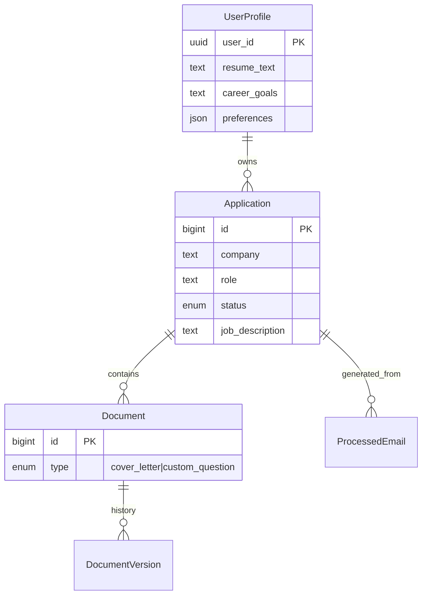

# Waypoint - LLM Context Document

## Project Overview
**Name**: Waypoint (internal: application-helper)
**Description**: A personal job application tracker with AI-powered content generation and Gmail integration.
**Type**: Monorepo (npm workspaces) containing Client (React), Server (Express), and Electron (Shell).
**Primary Data Store**: Supabase (PostgreSQL) with Row Level Security (RLS).

## Tech Stack

### Frontend (`/client`)
- **Framework**: React 18
- **Build Tool**: Vite
- **Language**: TypeScript
- **State Management**: React Query (@tanstack/react-query)
- **Styling**: CSS Modules (`*.module.css`)
- **Routing**: React Router DOM v6+
- **HTTP Client**: Native `fetch` wrapper (`client/src/services/api.ts`) with auto-retry for 401s.

### Backend (`/server`)
- **Runtime**: Node.js 18+
- **Framework**: Express.js
- **Language**: TypeScript
- **Database**: PostgreSQL via `@supabase/supabase-js`
- **Authentication**: Bearer Token (Supabase Session) -> Scoped DB Client
- **AI**: OpenAI API (GPT-4o-mini)
- **Email**: Gmail API (googleapis)

### Desktop Wrapper (`/electron`)
- **Type**: Electron wrapper around the Node.js server.
- **Role**: Spawns the server process (in Prod) or connects to localhost (in Dev).
- **Offline Support**: **None** (Requires active internet connection for Supabase/OpenAI).

## Architecture & Control Flow

### 1. Authentication & Data Security
*Critical: The app uses a "Scoped Client" pattern for security.*

*   **Middleware**: `requireAuth` (`server/src/middleware/auth.ts`)
*   **Mechanism**:
    1.  Extracts `Bearer` token from `Authorization` header.
    2.  Verifies token via `supabase.auth.getUser(token)`.
    3.  **Key Step**: Creates a *new* `SupabaseClient` instance scoped to this specific user's auth context.
    4.  Attaches `req.supabase` and `req.user` to the Express request object.
*   **Implication**: All service calls must use `req.supabase` (not a global admin client) to ensure **Row Level Security (RLS)** policies are automatically enforced by the database.

### 2. API Request Lifecycle
`Client Component` -> `React Query` -> `api.ts` -> `Express Route` -> `requireAuth` -> `Service (with scoped DB)` -> `Response`

**Error Handling**:
*   Backend uses `ApiError` class.
*   `asyncHandler` wrapper catches promise rejections.
*   Global error middleware sanitizes errors:
    *   **Dev**: Returns full error stack.
    *   **Prod**: Returns generic messages ("Invalid request", "An unexpected error occurred") unless the error matches a "safe" whitelist.

### 3. Key Workflows

#### A. Application Management (CRUD)
*   **Frontend**: `useCreateApplication` -> `applicationsApi.create`
*   **Backend**: `POST /api/applications`
*   **Service**: `applicationsService.create(req.supabase, data)`
    *   Directly inserts into `applications` table.
    *   RLS policy `Users can crud own applications` ensures data isolation.

#### B. AI Content Generation
*   **Frontend**: `useAi.generateCoverLetter` -> `generateApi.coverLetter`
*   **Backend**: `POST /api/generate/cover-letter`
*   **Service**: `aiService.generateCoverLetter`
    1.  **Context Building**: Fetches Profile, Experience, Skills, and target Application details via `req.supabase`.
    2.  **Prompt Engineering**: Combines system prompt ("Expert Career Coach") with JSON-structured context.
    3.  **Execution**: Calls OpenAI `gpt-4o-mini`.
    4.  **Result**: Returns generated text + prompt metadata.

#### C. Gmail Synchronization
*   **Trigger**: User initiates via UI (`POST /api/email/sync`).
*   **Service**: `emailSyncService.syncEmails`
    1.  **Fetch**: Gets recent emails via Gmail API.
    2.  **Filter**: Checks `processed_emails` table to skip duplicates.
    3.  **Process**:
        *   Sends email body/subject to OpenAI for classification.
        *   Extracts: `isJobRelated`, `company`, `role`, `status` (e.g., "Interview", "Rejected").
    4.  **Action**:
        *   **Match**: Updates existing application status (e.g., "Applied" -> "Interview").
        *   **New**: Creates new application record.
    5.  **Log**: Records result in `processed_emails`.

## API Route Map

| Endpoint | Method | Service Function | Notes |
| :--- | :--- | :--- | :--- |
| `/api/applications` | GET, POST | `applicationsService` | Filterable by status/company |
| `/api/applications/:id` | GET, PUT, DEL | `applicationsService` | ID validation included |
| `/api/generate/cover-letter` | POST | `aiService` | Requires configured OpenAI Key |
| `/api/email/sync` | POST | `emailSyncService` | Long-running process |
| `/api/email/auth-url` | GET | `gmailAuth` | Redirects to Google OAuth |
| `/api/profile` | GET, PUT | `profileService` | 1:1 relation with User |

## Data Models (PostgreSQL + RLS)

*Note: `user_id` is present on all tables but handled transparently via RLS.*

## Directory Structure & Key Files

### Backend (`server/src`)
*   **`middleware/auth.ts`**: **CRITICAL**. Handles Supabase client scoping.
*   **`services/`**: Pure business logic.
    *   `ai.ts`: Context assembly & OpenAI calls.
    *   `email-processor.ts`: Logic to classify emails (Job vs Spam).
*   **`db/`**:
    *   `multi-user-schema.sql`: Authoritative Postgres schema.
    *   `index.ts`: Supabase client initialization.

### Frontend (`client/src`)
*   **`services/api.ts`**:
    *   Handles `Authorization: Bearer <token>` injection.
    *   Auto-refreshes session on 401.
*   **`hooks/useAi.ts`**: Encapsulates generation mutations.

## Testing
- **Framework**: `vitest` (compatible with Jest API).
- **Scope**:
  - **Unit**: Utils (`crypto.ts`) and Services (`email-processor.ts`).
  - **Mocks**: External APIs (OpenAI) are mocked to prevent cost/latency.
- **Commands**: `npm test` (root) or `npm test --workspace=server`.

## Deployment & Config

*   **Environment**: Requires `.env` with:
    *   `SUPABASE_URL`, `SUPABASE_SERVICE_KEY`
    *   `OPENAI_API_KEY` (Optional, can be set in user DB settings)
    *   `GOOGLE_CLIENT_ID`, `GOOGLE_CLIENT_SECRET` (For Gmail)
*   **Database**:
    *   Managed via Supabase Dashboard / SQL Editor.
    *   Local migrations found in `server/src/db/*.sql`.